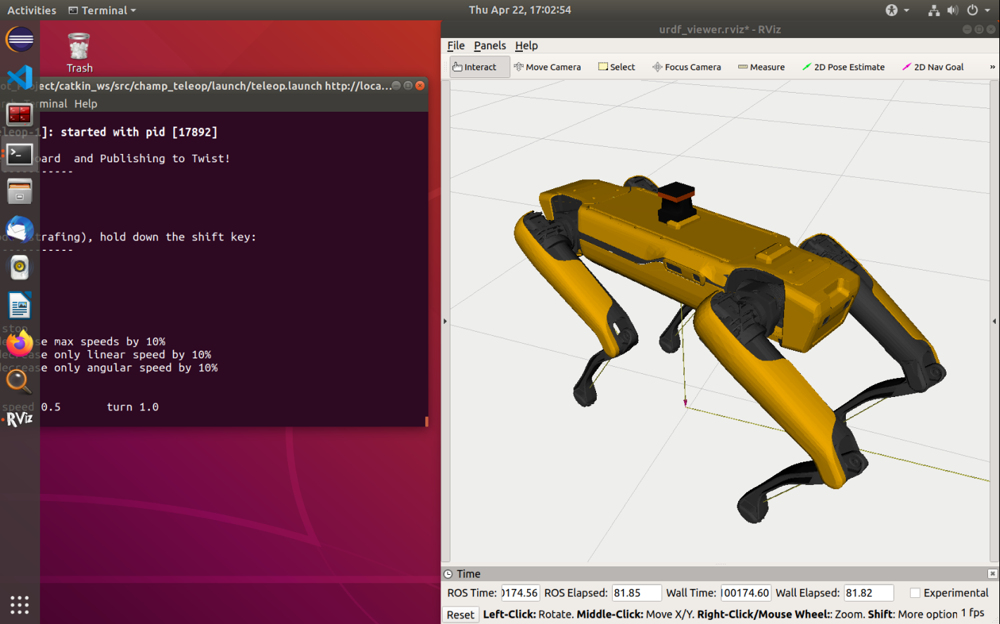

## Spot_Fetch_a_Drink

[toc]

This is the repository for Project Spot Fetch a Drink at Aalto University.

In this project, we are going to develop a voice command functionality for the [Spot Robot](https://www.bostondynamics.com/spot), the package has been tested on 

- Ubuntu 18.04 with ROS Melodic
- Ubuntu 20.04 with ROS Noetic

Upon project completion, Spot would become a nice life assistant, which is able to take voice command from you and perform tasks, like fetching an object and going somewhere.
The applications of this project includes routine inspection and damage fixing in a large factory plant, autonomous guiding for blind people and daily care for the elderly/children or disabled people.

### Setting up your branch 

Get this repo and create your own branch.

- Open a terminal where you wish to store the files

- Clone the repo with `git clone https://github.com/Weijiang-Xiong/Spot_Fetch_a_Drink.git Spot_Masters`

- Navigate to the folder `cd Spot_Masters`

- Create your branch `git checkout -b your_branch_name`

- Push to remote and create a remote branch `git push origin your_branch_name`

- Keep track of the remote branch you just created `git checkout -b your_branch_name --track <remote>/your_branch_name`

Then you are on your own branch, and you can work on your own module, say create some new functionality for the project.

If you want to work on a sub-branch of your branch, like develop some new features based on your module.

- Create a new branch based on your existing branch `git checkout -b some-feature your_branch_name`

- When you have done this new feature, add the new files or modified files to git `git add path_to_files`

- commit the change `git commit -m "developed a feature to do something"`

- Merge the new feature to your branch (merging branch to main branch is similar)
``` bash
git pull origin your_branch_name
git checkout your_branch_name
git merge --no-ff some-feature
git push origin your_branch_name
```

### Install and run Champ Simulator

This step involves the following repos

- Champ simulator https://github.com/chvmp/champ
- Champ Model Zoo https://github.com/chvmp/robots/tree/master/configs/spot_config
- Champ Spot Driver for Gazebo https://github.com/chvmp/spot_ros
- See original Spot Driver https://github.com/clearpathrobotics/spot_ros

The following codes will use `catkin tools` , you can install it with `sudo apt-get install python-catkin-tools`. You can of course use `catkin_make` instead of `catkin build`.

```bash
conda deactivate 
mkdir -p ~/Spot_Project/catkin_ws/src

cd ~/Spot_Project/catkin_ws/
source /opt/ros/melodic/setup.bash
catkin init

sudo apt install -y python-rosdep

# install champ simulator, spot driver for gazebo and robot configs
cd ~/git
git clone --recursive https://github.com/chvmp/champ
git clone https://github.com/chvmp/champ_teleop
git clone -b gazebo https://github.com/chvmp/spot_ros
git clone https://github.com/chvmp/robots.git

# create symbolic link to the catkin workspace
ln -s ~/git/champ/ ~/Spot_Project/catkin_ws/src/
ln -s ~/git/champ_teleop/ ~/Spot_Project/catkin_ws/src/
ln -s ~/git/spot_ros/ ~/Spot_Project/catkin_ws/src/
ln -s ~/git/robots/ ~/Spot_Project/catkin_ws/src/

cd ~/Spot_Project/catkin_ws/
sudo rosdep fix-permissions
rosdep install --from-paths src --ignore-src -y

# build those packages, takes a little time 
catkin build
source ~/Spot_Project/catkin_ws/devel/setup.bash

# teleop demo
roslaunch spot_config bringup.launch rviz:=true
roslaunch champ_teleop teleop.launch
```

And you can move the robot with keyboard 




### Setup the Mapping and Navigation

To be added...

### Setup Speech Recognition

This section summarizes the installation guide here https://github.com/Uberi/speech_recognition#readme.

Build PocketSphinx-Python from source 

```bash
sudo apt-get install python python-all-dev python-pip build-essential swig git libpulse-dev libasound2-dev
python -m pip install pocketsphinx
```

Install python SpeechRecognition package, pyAudio 

```bash
sudo apt-get install python-pyaudio python3-pyaudio
python -m pip install google-cloud-speech
python -m pip install SpeechRecognition
```

Install ros speech recognition package, then fix a small bug.

```bash
sudo apt install ros-melodic-ros-speech-recognition
roscd ros_speech_recognition/launch/
sudo gedit speech_recognition.launch
```

modify the default device number in `speech_recognition.launch` from "" to "0"

```bash
<arg name="device" default="0" /> 
```

### Setup NLP Part

```bash
# NLTK natural language toolkit, last version with python 2.7 support
python -m pip install nltk==3.4.5
# install aria2c for multi thread download
sudo apt install snapd
sudo snap install aria2c
# download the library
aria2c -x 4 http://nlp.stanford.edu/software/stanford-corenlp-latest.zip
unzip stanford-corenlp-latest.zip
mv ./stanford-corenlp-4.2.0/ ./CoreNLP
cd CoreNLP
# download an additional model
aria2c -x 4 http://nlp.stanford.edu/software/stanford-corenlp-4.2.0-models-english.jar
```

run CoreNLP server

```bash
export CLASSPATH=$CLASSPATH:~/Spot_Project/CoreNLP/*:
cd ~/Spot_Project/CoreNLP
java -mx4g -cp "*" edu.stanford.nlp.pipeline.StanfordCoreNLPServer \
-preload tokenize,ssplit,pos,lemma,ner,parse,depparse \
-status_port 9000 -port 9000 -timeout 15000 &
```


### Setup Object Detection Node

```bash
# Note: Object Detection tested on Noetic, but should work with Melodic and python2 as well. 
sudo apt install python3-rosdep2
rosdep update
rosdep install --from-paths src --ignore-src -r -y --rosdistro noetic

# Clone the darknet repo and follow the setup instructions
cd ~/Spot_Project/catkin_ws/src/
git clone --recursive git@github.com:leggedrobotics/darknet_ros.git

# Make sure to install cuda using 
sudo apt install nvidia-cuda-toolkit

```

Confirm with `nvcc --version` and `nvidia-smi` commands that it is installed correctly

If you are on Noetic, make sure to replace `BGR` with `RGB` in `~/Spot_Project/catkin_ws/src/darknet_ros/darknet_ros/src/YoloObjectDetector.cpp` in case if the image colors look wrong.

If you want to use the custom model for simulator that we trained, you can download our weights from [yolov3.weights+configuration](not available yet) or [yolov3_tiny.weights+configuration](to be added) if you'd like to trade accuracy for speed. The instructions for setting up custom weights can be found on `https://github.com/leggedrobotics/darknet_ros`


```bash
#In case if you would like to train your own model, you can use for example 
github.com:confiscar/ROScreenShot
# for capturing `/camera/image_raw` topic and then label the pictures using 
github.com:ManivannanMurugavel/Yolo-Annotation-Tool-New-
# You might have to run 
sudo apt-get install python3-pil python3-pil.imagetk

#After labeling is done, just train it as you would train a regular Yolo model at ~/Spot_Project/catkin_ws/src/darknet_ros/

```

Our trained model includes the following classes: 

```bash
- beer
- coke
- extinguisher
- hammer
- screwdriver
- wrench
- person

```

If you are missing these models in your gazebo environment, clone this repo to your source folder and add the directory to gazebo `git clone https://github.com/osrf/gazebo_models`

```bash
# If you haven't yet started the simulator do so 

cd ~/Spot_Project/catkin_ws/
catkin_make
source ./devel/setup.bash
roslaunch champ_gazebo spawn_world.launch    
roslaunch spot_config spawn_robot.launch world_init_x:=-2 world_init_y:=1
roslaunch champ_teleop teleop.launch

# Start darknet node
roslaunch darknet_ros darknet_ros.launch

```
If the compiler complains about the g++ gcc version, try the following [fix](https://github.com/espressomd/espresso/issues/3654): 

```bash
# Start image processing node
# Make sure that the CMakeLists.txt file in src/image_processing folder points to the correct darknet_ros directory, then run
python3 ~/Spot_Project/catkin_ws/src/image_processing/scripts/Yolo_xyz_node.py

# If everything is done correctly, it should be posting XYZ coordinates of the detected object to /object_detection topic 

```	


